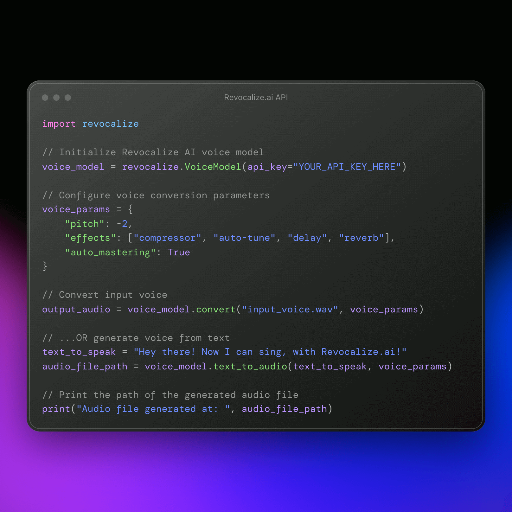

</img>

[](https://discord.gg/revocalize)
[](https://twitter.com/revocalize)
[](https://pypi.org/project/elevenlabs/)

The official Python API for [Revocalize.AI](https://www.revocalize.ai/) voice generation software. Revocalize creates & trains studio-quality AI voices in one-click – or you can choose from our officially licensed AI voice models.

## ⚙️ Install

```bash
pip install revocalize
```

</img>

## 🎙️ Generate AI Voice
[](https://huggingface.co/spaces/revocalize/demo)
[](https://colab.research.google.com/gist/revocalize/revocalize/revocalize-python.ipynb)


```py
import revocalize

# Initialize Revocalize AI voice model
voice_model = revocalize.VoiceModel(api_key="YOUR_API_KEY_HERE")

# Configure voice conversion parameters
voice_params = {
    "pitch": -2,
    "effects": ["compressor", "auto-tune", "delay", "reverb"],
    "auto_mastering": True
}

# Convert input voice
output_audio = voice_model.convert("input_voice.wav", voice_params)

# Generate voice from text
text_to_speak = "Hey there! Now I can sing, with Revocalize.ai!"
audio_file_path = voice_model.text_to_audio(text_to_speak, voice_params)

# Print the path of the generated audio file
print(f"Audio file generated at {audio_file_path}")
```

## 🏋️‍♀️ Train AI Voice

With the Revocalize.ai API you can train AI voice models in < 1 minute. The `train()` accepts either a ZIP file with the audio training data or multiple training audio URLs (.WAV, .MP3, .FLAC).
```py
import revocalize

# Initialize new Revocalize AI voice model
voice_model = revocalize.VoiceModel(api_key="YOUR_API_KEY_HERE")

# Send AI model to training in the cloud
voice_model.train("path_to_your_training_data.zip")
```

## 🗣️ AI Voices

List all your available AI voices on your Revocalize.ai account with `voices()`:
```py
import revocalize

# List all available voices
voices = revocalize.voices(api_key="YOUR_API_KEY_HERE")

# Print your AI voice models
print(voices)
```

## 🔑 API Key

Start using the Python  API by obtaining your API key from [Revocalize.ai](https://www.revocalize.ai/) ([step-by-step guide](https://docs.revocalize.ai/authentication)). This key unlocks the character limit, giving you the freedom to create without boundaries. Set it as an environment variable `REVOCALIZE_API_KEY` or pass it as a string argument to the library functions. You can also set it globally in your code to the `set_api_key` function.

```py
from revocalize import set_api_key
set_api_key("<YOUR_API_KEY>")
```

## 📖 API & Docs

Learn more about the [Python API](https://docs.revocalize.ai/api-reference), or check out the [HTTP API documentation](https://docs.revocalize.ai/introduction).

## 📪 Contact

If you have any questions, suggestions, or need assistance, feel free to reach out to us:

- Email: [contact@revocalize.ai](mailto:contact@revocalize.ai)
- Twitter: [@Revocalize](https://twitter.com/Revocalize)
- GitHub: [Revocalize AI](https://github.com/Revocalize)

We're always happy to help and hear your feedback!


## 📄 Copyright

Copyright © 2023 Revocalize AI. All rights reserved.

Unauthorized copying, distribution, or use of this documentation or any part of it is strictly prohibited without the express permission of Revocalize AI. Please contact [contact@revocalize.ai](mailto:contact@revocalize.ai) for any inquiries or permissions.
